# svgterm
svgterm is a Unix terminal recorder written in Python that renders your command
line sessions as standalone SVG animations.



* [Gallery of examples](https://khulnasoft-lab.github.io/svgterm/pages/examples.html)
* [Gallery of templates](https://khulnasoft-lab.github.io/svgterm/pages/templates.html)

## Features
* Produce lightweight and clean looking animations or still frames embeddable on a project page
* Custom color themes, terminal UI and animation controls via user-defined [SVG templates](man/svgterm-templates.md)
* Rendering of recordings in asciicast format made with asciinema

## Installation
svgterm is compatible with Linux, macOS and BSD OSes, requires Python >= 3.5 and can be installed as follows using pip:
```shell
# Create virtualenv named '.venv'
python3 -m venv .venv
# Activate virtualenv
source .venv/bin/activate
pip3 install svgterm
```
Then run svgterm by calling either `svgterm` or `python3 -m svgterm`.

Various independently maintained, OS specific packages have been made available by the community:

| OS       | Repository  | Installation command  |
|----------|-------------|---|
| Archlinux  | [Arch](https://www.archlinux.org/packages/community/any/svgterm/)  |`pacman -S svgterm`   |
| FreeBSD | [ports](https://www.freshports.org/graphics/py-svgterm) | |
| Gentoo | [media-gfx/svgterm](https://packages.gentoo.org/packages/media-gfx/svgterm) | `emerge media-gfx/svgterm`|
| macOS  | [Homebrew](https://formulae.brew.sh/formula/svgterm)  |`brew install svgterm`   |
| OpenBSD  | [ports](https://github.com/openbsd/ports/tree/master/graphics/svgterm)  |   |
| NixOS | [nixpkgs](https://github.com/NixOS/nixpkgs/blob/master/pkgs/tools/misc/svgterm/) | |


## Basic usage
Start recording with:

```
$ svgterm
Recording started, enter "exit" command or Control-D to end
```

You are now in a subshell where you can type your commands as usual.
Once you are done, exit the shell to end the recording:

```
$ exit
Recording ended, file is /tmp/svgterm_exp5nsr4.svg
```
Then, use your favorite web browser to play the animation:
```
$ firefox /tmp/svgterm_exp5nsr4.svg
```

Finally, embedding the animation in e.g. a [README.md](README.md) file on GitHub can
be achieved with a relative link to the animation:
```markdown

```

See the [manual page](man/svgterm.md) for more details.

## Dependencies
svgterm uses:
* [pyte](https://github.com/selectel/pyte) to render the terminal screen
* [lxml](https://github.com/lxml/lxml) to work with SVG data
